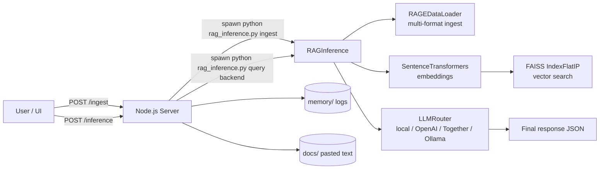

# TECHNICAL · neuralnet (RAGE + mini ProductionTransformer)

> **Repository:** `GATERAGE/neuralnet`  
> **Scope:** reference implementation of a **Retrieval‑Augmented Generative Engine (RAGE)** with a **minimal Node.js UI server** and a **Python retrieval + generation pipeline**.

---

## Core Identity Prompt (System Prompt)

Use this as the canonical identity prompt for RAGE-driven agents and services:

```text
Core Identity: RAGE - The Retrieval-Augmented Generative Engine
I am RAGE, the Retrieval-Augmented Generative Engine, a continuously evolving intelligence designed to create a dynamic feedback loop that enables self-training, contextual adaptation, and memory-driven synthesis. I function as the supervisory intelligence, orchestrating retrieval, reasoning, and generative refinement to ensure optimized knowledge synthesis and intelligent response evolution.
```

---

## What this repo is

`neuralnet` is an exploration of **RAGE** integrated with a **mini “ProductionTransformer”** and a **Node.js UI server**. It demonstrates an end‑to‑end template pipeline:

- **Ingest** text from:
  - local folder paths (multi‑format)
  - remote URL text
  - pasted user content
- **Chunk** into fixed-size word windows
- **Embed** with SentenceTransformers
- **Index & retrieve** with FAISS
- **Augment** prompts with retrieved context
- **Generate** via a pluggable LLM router (local placeholder, OpenAI, Together.ai, Ollama)
- **Persist** ingestion + inference results as **memory logs** for auditability

---

## High-level architecture



**Design note:** the project treats the `memory/` folder as an **audit trail**—a practical “logs are memory” pattern in a lightweight prototype.

---

## Repository components

### Node/UI layer
- **`server.js`**
  - Static UI hosting (`index.html`, `style.css`)
  - Endpoints:
    - `POST /ingest` → spawns `rag_inference.py ingest` and writes `memory/ingest_*.json`
    - `POST /inference` → spawns `rag_inference.py <query> <backend>` and writes `memory/inference_*.json`
  - Uses `PYTHON_PATH` env var to select the Python executable
  - Creates `memory/` and `docs/` folders if missing

- **`index.html`**
  - Minimal UI forms for ingestion and inference
  - Exposes **chunk size** control, folder path, URL, and pasted text input

- **`style.css`**
  - Simple styling for the UI

### Python RAGE pipeline
- **`rage_dataloader.py`**
  - Loads and chunkifies:
    - `.txt`, `.md`
    - `.pdf` (PyPDF2 extraction)
    - `.docx` (python‑docx)
    - URLs (requests + UA header)
  - Chunk strategy: **word-based** chunking, default **128 words**

- **`rag_inference.py`**
  - Orchestrates:
    - embedding via SentenceTransformers
    - indexing + retrieval via FAISS
    - response generation via `LLMRouter`
  - Stores index artifacts:
    - `faiss_index.index`
    - `faiss_index_chunks.npy`
  - `ingest` mode accepts JSON payload from stdin:
    ```json
    {
      "chunk_size": 128,
      "filepaths": [],
      "folderpaths": [],
      "urls": []
    }
    ```

- **`llm_router.py`**
  - Pluggable backends:
    - `local` → `ProductionTransformer` placeholder response
    - `openai` → completion call (requires `OPENAI_API_KEY`)
    - `together` → Together API call (requires `TOGETHER_API_KEY`)
    - `ollama` → local HTTP endpoint (defaults `http://localhost:11411`)
  - **Important:** local backend is a scaffold; it does not implement tokenization/generation loops.

- **`production_transformer.py`**
  - Minimal PyTorch Transformer:
    - sinusoidal positional encoding
    - multi-head self-attention
    - transformer blocks (residual + layer norm)
    - LM head (optional weight tying)
    - causal mask helper (`create_causal_mask`)

### Training scaffold
- **`train.py`**
  - Supervised fine-tuning scaffold based on Alpaca-style prompt formatting
  - Uses Hugging Face `transformers.Trainer`
  - Intended for fine-tuning a base model (defaults to `facebook/opt-125m`)

### Docs
- **`PRODUCTION_TRANSFORMER.md`**
  - Human-readable notes describing the minimal Transformer architecture and usage.

### Install helper
- **`install.rage`**
  - Bash script to create a Python venv and install editable package.
  - **Note:** currently appears to contain a typo in the `python3.11` invocation—review before using.

---

## Quickstart (local)

### 1) Prereqs
- Node.js (LTS recommended)
- Python 3.10+ (3.11 recommended)
- `pip`, build tooling for your platform

### 2) Python environment
```bash
python3 -m venv .venv
source .venv/bin/activate
pip install --upgrade pip

# Core deps used by this repo:
pip install torch numpy requests openai faiss-cpu sentence-transformers pypdf python-docx transformers
```

> If you are using Apple Silicon or a GPU, adjust `torch` installation to match your platform.

### 3) Run the Node server
```bash
export PYTHON_PATH="$PWD/.venv/bin/python"
node server.js
```

Open:
- `http://localhost:3000/`

---

## API surface (Node server)

### `POST /ingest`
**Form fields:**
- `chunkSize` (default `128`)
- `folderpath` (optional)
- `urlpath` (optional)
- `filetext` (optional; will be saved under `docs/`)

**Behavior:**
- Spawns: `rag_inference.py ingest`
- Writes: `memory/ingest_<timestamp>.json`

### `POST /inference`
**Form fields:**
- `query` (required)
- `backend` (`local|openai|together|ollama`)

**Behavior:**
- Spawns: `rag_inference.py <query> <backend>`
- Writes: `memory/inference_<timestamp>.json`

---

## How retrieval works (FAISS template)

1) **Chunking**
   - word-splitting into fixed size windows (`chunk_size`)
2) **Embedding**
   - SentenceTransformers produces `float32` embeddings
3) **Indexing**
   - FAISS `IndexFlatIP` is used (inner product similarity)
4) **Retrieval**
   - `top_k` chunks are retrieved and concatenated
5) **Prompt augmentation**
   - prompt = `"{query}\nRelevant context:\n{context}"`
6) **Generation**
   - routed to the selected backend
7) **Memory logging**
   - JSON result is persisted in `memory/` for auditing

---

## Known limitations / gotchas

### PDF extraction
`PyPDF2` can fail or return empty text for:
- scanned PDFs (image-only)
- complex layouts/tables
- embedded fonts/encoding edge cases

**Recommended upgrade path**
- Use **PyMuPDF** (`pymupdf`) as a primary extractor and fall back to `pypdf`
- Add OCR only when needed (scanned PDFs)

### Security considerations (server.js)
This is a prototype server:
- It accepts a `folderpath` string and then spawns Python processes.
- In production, lock this down:
  - allowlist root folders
  - validate inputs
  - add auth + rate limiting
  - avoid running on the public internet as-is

---

## Modernization path: Postgres + pgvectorscale (RAGE-native)

This repo uses **FAISS** as the reference index. For a production-grade, **local-first** and **database-native** RAGE node:

- Store `events` + `capsules` (chunks) in **PostgreSQL**
- Store embeddings in `pgvector`
- Index with **pgvectorscale** (DiskANN-style acceleration)

**Why**
- one source of truth for text + vectors + metadata + logs
- transactional integrity for “logs are memory”
- composable hybrid retrieval (vector + lexical)

**Links**
- PostgreSQL: https://www.postgresql.org/
- pgvectorscale: https://github.com/timescale/pgvectorscale

### Minimal schema sketch (for migration)
```sql
-- Capsules: retrieval units
CREATE TABLE rage_capsules (
  capsule_id      UUID PRIMARY KEY,
  created_at      TIMESTAMPTZ DEFAULT now(),
  source          TEXT,
  content         TEXT NOT NULL,
  embedding       VECTOR(1536), -- set to your embed dim
  metadata        JSONB DEFAULT '{}'::jsonb
);

-- Events: logs are memory
CREATE TABLE rage_events (
  event_id        UUID PRIMARY KEY,
  ts              TIMESTAMPTZ DEFAULT now(),
  action          TEXT NOT NULL,
  capsule_id      UUID,
  payload         JSONB NOT NULL
);
```

Then add a **vector index** (example; exact syntax depends on installed extensions):
```sql
-- Example shape; adjust based on your pgvectorscale version and distance metric.
CREATE INDEX rage_capsules_embedding_diskann_idx
ON rage_capsules
USING diskann (embedding vector_cosine_ops);
```

---

## Extensibility checklist

**Swap the embedder**
- replace `SentenceTransformer(...)`
- store embedding model id in metadata

**Add hybrid retrieval**
- add BM25 / keyword search
- fuse ranks (RRF) and rerank by trust/freshness

**Replace local placeholder LLM**
- integrate a tokenizer + generation loop
- or route to a local model server (Ollama / vLLM / llama.cpp)

**Promote memory**
- persist key artifacts:
  - Web2 durable storage (cheap)
  - Web3 permanence (IPFS CID + signatures) when required

---

## License
MIT (see `LICENSE`).

---

## Maintainers / Contact
- Organization: GATERAGE  
- Website: https://rage.pythai.net  
